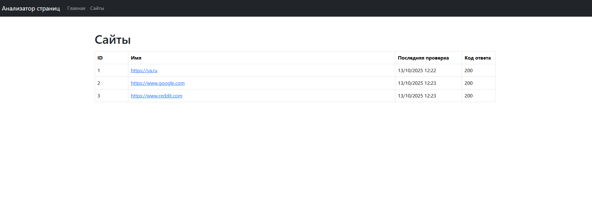

### Hexlet tests and linter status:

## [Page Analyzer](https://java-project-72-1-rvhc.onrender.com/)

## Описание проекта

* **Page Analyzer** – сайт, который анализирует указанные страницы на SEO пригодность.

